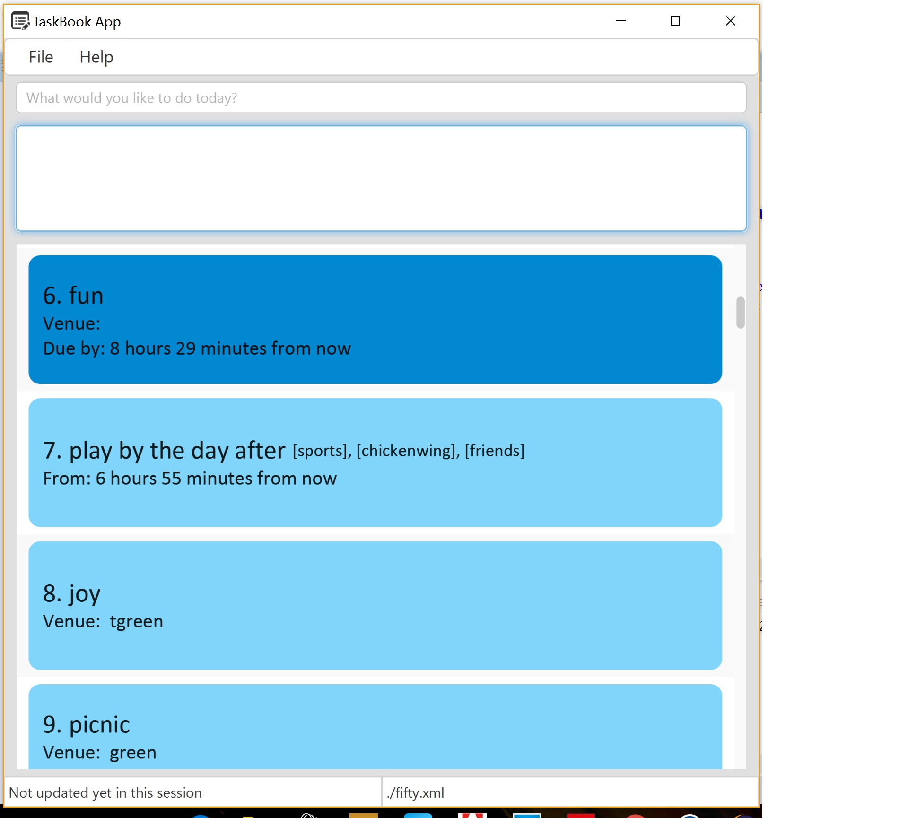

# Task Book

 

We are bombarded with ‘things to do’ continuously. Some things need to be done during specific **times** (e.g., attend meeting), some have **deadlines** (e.g., submit report), and others are simply ‘to be done someday’ (e.g., read ‘Lord of the Rings’). The pile of **todo** items accumulates and weighs heavily on our mind at times. Sometimes things go out of control and we forget to do certain things on time.

Hence, taskBook is created to help users put these **todo items** into a systematic process that tracks them and helps them to decide on what to do and when to do things so that the user doesn’t have to remember the todo items.

This is a desktop Task Book application. It has a GUI but most of the user interactions happen using 
  a CLI (Command Line Interface) because Jim has amazing fingers.

  
  
#### Site Map
* [User Guide](docs/UserGuide.md) 
* [Developer Guide](docs/DeveloperGuide.md) 
* [About Us](docs/AboutUs.md)
* [Contact Us](docs/ContactUs.md)

#### Acknowledgements

* Some parts of this sample application were inspired by the excellent 
  [Java FX tutorial](http://code.makery.ch/library/javafx-8-tutorial/) by *Marco Jakob*. 

#### Licence : [MIT](LICENSE)
