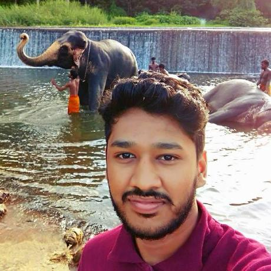
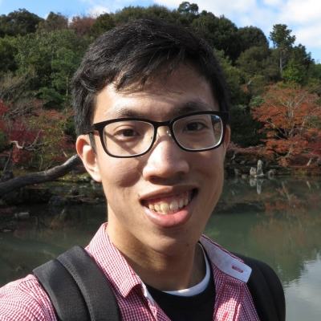
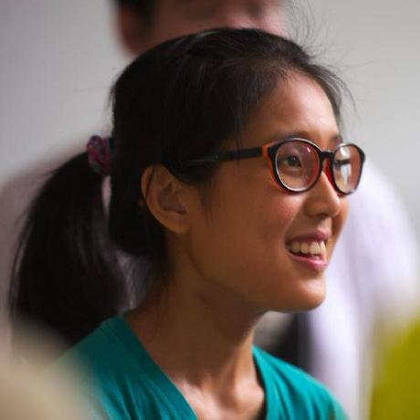

# About Us

We are a team based in the [School of Computing, National University of Singapore](http://www.comp.nus.edu.sg).

## Project Team

#### Rahman (https://github.com/arshrahman)
arsh.abdulrahman@hotmail.com

 

**Components in charge of:** CRUDs, 

**Aspects/tools in charge of:** Testing, code quality

**Features implemented:**

Add task

Delete task

Update task

Undo task

**Code written:** [functional code][test code][docs]

**Other major contributions:**

Set up Travis

#### Zhe Min (https://github.com/zhems)

chiazhemin@gamil.com

 

**Components in charge of:** Model, UI

**Aspects/tools in charge of:** GUI Testing, Find command, Sorting/Filtering

**Features implemented:**

Modern UI design

Find tasks

Automated sorting of tasks

Code written: [functional code][test code][docs]

Other major contributions:

#### Clara (https://github.com/hotchocolatemarshmallow)
hotchocolatemarshmallow35211@gamil.com

 

**Components in charge of:** Storage

**Aspects/tools in charge of:** Documentation

**Features implemented:**

Move Storage filepath

Shortkey implementation

**Code written:** [functional code][test code][docs]

**Other major contributions:**

#### [Damith C. Rajapakse](http://www.comp.nus.edu.sg/~damithch)  
 
**Role**: Lecturer

####[Joel](https://github.com/se-edu/addressbook-level4/pulls?q=is%3Apr+author%3Aokkhoy)  
**Role**: tutor
-----

# Contributors

We welcome contributions. See [Contact Us](ContactUs.md) page for more info.