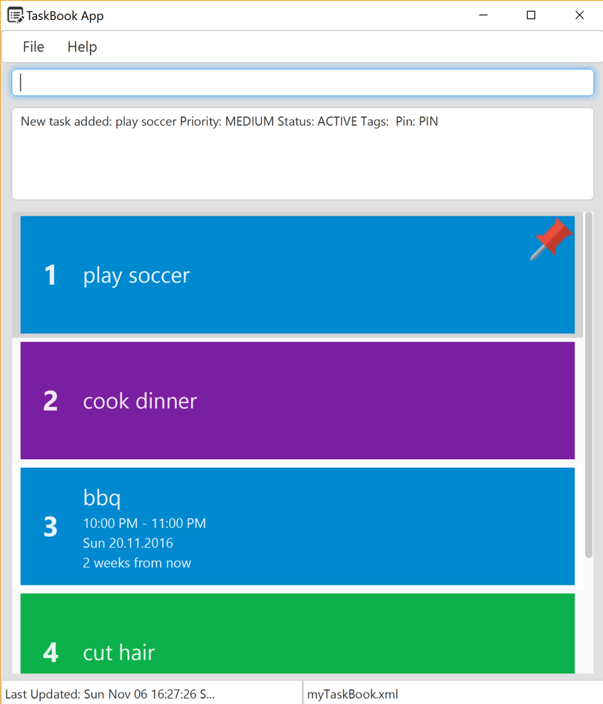

<!-- @@author A0141064U -->

##Project name: taskBook

**Vision:** An intelligent and personalised task scheduler for Jim

##Userguide: 

 

The general command structure is to type the `command key` + other details.

**status of the tasks displayed**

 

blue: active

red: expired

ignore: grey

done: black

The following icons are used in our display: 

 

The tasks are sorted as follows: 
1) By status 
* Active and Expired tasks are at the top,
* Done and Ignored are at the bottom

2) By pin
* pinned tasks are at the top

3) By priority
* tasks with higher priority are at the top

4) By time
* tasks will be sorted with the earlier date at the top

**Adding tasks**

 

Task Book supports highly flexible command format. The user can enter command in any order and Task Book intelligently identifies the contents based on keywords and natural language processing.

For example, 
To add a task, type `add` + `taskname` + `from start time` + ` by end time` + `#task_priority` + `#tags` + `@venue`  + `pin status`

* Eg, user can type `add` `play soccer` `from tomorrow 2pm` `to 6pm` `#high` `#sport` `@Utown` ` #pin`

This same command can be written in any order. Other alternatives

* Eg, user can type `add` `from tomorrow 2pm` `to 6pm` `play soccer` `@Utown` ` #pin` `#high` `#sport`  
* Eg, user can type `add` `@Utown` `play soccer`  `from tomorrow 2pm` `to 6pm` `#sport` ` #pin` `#high` 

In addition to that, Task Book also supports parameter within parameter. For example,

* Eg, user can type `add` success party from 6pm to 8pm for compeleting CS2103 project @soc #party #high #pin

Notice how the start and end dates are contained within the task name. Task Book is able to intelligently seperate task name from other parameters. So, for the above example

* Task Name: success party for compeleting CS2103 
* project start date: 6pm 
* end date: 6pm
* venue: soc
* priority: high
* status: active
* pin: true
* tags: party

Only the command key and taskname are compulsory; other fields are optional and it would take default or null values if not entered. The rules for adding to the other fields are as follows:

`taskname`: Task names should be AlphaNumeric.

`Date`: Start date has to be followed by the keyword `from`. End date has to be followed by the keyword `by`. If the command contains start date and end date, then alternatively, `from` and `to` can also be used to denote the dates respectively. All keywords are case insensitive.

`Note:` Although `from`, `by`, `to` are keywords for the dates, they can be used in task name as well. Task Book is able to intelligently identify if they mean date or name.

Task Book uses Natty Natural language processing Date parser to identify dates in the command.

Dates can be any of the following formats 
* formal dates (02/28/1979), 
* relaxed dates (oct 1st), 
* relative dates (tomorrow, the day before next thursday), 
* and even date alternatives (next wed or thurs).

`time`: The above date formats may be prefixed or suffixed with time information. 
* Eg: 0600h,06:00 hours,6pm, 5:30 a.m., 5, 12:59, 23:59, noon, midnight

Read more about [Natty Date Parser](http://natty.joestelmach.com/)

`priority`: Will be `medium` by default. The priority can be of `low`, `medium`, `high`.

`#`: tags. The tags cannot be `high`, `low`, `medium`, `unpin`, `pin` and `null`. These are reserved keywords for other parameters.

`@`: venue. It is also possible to concatenate venues by using `@` as a prefix for the venue names.

`Pin`: indicates whether the task should be pinned.

`Status`: This is set by Task Book itself when a new task is added. The default value is `Active`. If the task has and end date, then after the end date, Task Book will update the status of task to `Expired` automatically. The user can only set the task status to be `done` or `ignore`.

**Input Validation**

new tasks that clash with the other tasks that are already in taskBook will not be added

 

**Changing the setting of our tasks**
Typing `set` `index` `new setting` updates the setting of the task

the settings available are  
 

`ignore`: Eg type `set` + `2` + `ignore` causes task 2 to be ignored

`done`: Eg type `set` + ` 1` + `done` will set the settings of task 1 to be done

**Listing tasks**

Executing the command `list` will result in a complete list of tasks sorted by priority. The tasks that are pinned will be at the top of the list.

**Finding tasks** 

 

taskBook can filter the tasks according to the following fields: 
*note that in each field, `keyword` does not need to be fully spelt out:

eg `find` + `play` will return all tasks names that contains `play`
*ie `playground`, `playstation`, `play piano`, `role play`

the keyword of task names 
*by typing `find` + `keyword`

the venue
*by typing `find`+ `@` + `keyword`
*keyword is a venue

the tags
*by typing `find` + `#` + `keyword`
*keyword is a tag that exists

the priority
*by typing `find` + `#` + `keyword`
*the keyword can either be `high`, `medium`, `low`

the status
*by typing `find` + `#` + `keyword`

**Deleting tasks**

To `delete` a task on the list that is on the screen, type `delete` [ index of task in the list] 
* eg `delete 1 `

`delete` can also be done for multiple tasks
* eg `delete 1 2 3` deletes tasks 1,2 and 3.

**updating tasks**

 

To update a task type `update` (index of task in the list or name of task) (field) (changes)
* Eg: Typing `update 1 by 120316` will change the **deadline** of the first task to 12 March 2016
* Eg: Typing `update soccer @Casa` will change the **venue** of the soccer task to Casa.
* Eg: Typing `update 1 #high` will change the **task priority** to high
* Eg: Typing `update 1 #unpin` will **unpin** the task

Multiple fields can be updated in a single command
* Eg: Typing `update 2 #high @home` changes the priority of task 2 to high and change the venue to home

Fields can also be updated to be empty
* Eg: Typing `update 3 @null` removes the venue of the third task in the list. 

**Undo and redo:**
To undo the latest change to taskbook, type `undo`.

Actions that can be undone is **adding tasks**, **deleting tasks** and **updating tasks**. 

note that taskbook subsequently returns the list of all the task after each undo

Undo and redo can be done multiple times

**Creating shortkeys**

 

To change a shortkey for the command, type `shortcut` + `{the field you are changing}` + `{shortkey you want to initialise}` eg: ``shortcut` `add` `a` changes the shortkey for the command `add` to `a`. The next time you want to execute 'add' to add 'running' to your tasklist, simply type `a running`.

Shortkeys can be set for `add`, `delete` and `list` commands. 

This feature is only available for **Add**, **Delete** and **List**. 

**Moving taskbook to another storage location** 

 

To save the taskbook in another file place, type `file` + `new storage location` that you want to move taskbook to. 

eg `move \dropbox\mytask` will keep taskbook in a folder called 'dropbox', which will be named 'mytask.xml'. 

