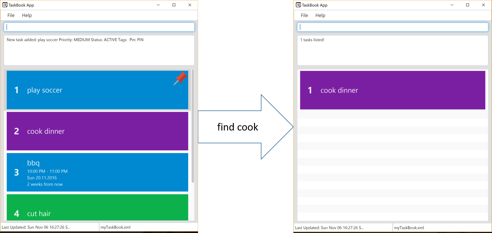

<!-- @@author A0141064U -->

##Project name: taskBook

**Vision:** An intelligent and personalised task scheduler for Jim

##Userguide: 

 

The general command structure is to type the `command key` + other details.

**Adding tasks**

 

To add a task, type `add` + `taskname` + `from start time` + ` by end time` + `#task_priority` + `#tags` + `@venue`  + `pin status`

* Eg, user can type `add` `play soccer` `from tomorrow` `by 12/12/16 2pm` `#high` `#sport` `@town green` ` #pin`

Only the command key and taskname are compulsory; other fields are optional and will take default or null values if not entered. The rules for adding to the other fields are as follows:

`taskname`: Task names cannot include `@`, `#`,`by` and `from`

`Date`: it can accept 
* formal dates (02/28/1979), 
* relaxed dates (oct 1st), 
* relative dates (tomorrow, the day before next thursday), 
* and even date alternatives (next wed or thurs).

`time`: The above date formats may be prefixed or suffixed with time information. 
* Eg: 0600h,06:00 hours,6pm, 5:30 a.m., 5, 12:59, 23:59, noon, midnight

Read more about [Natty Date Parser](http://natty.joestelmach.com/)

`priority`: Will be medium by default. The priority can be of `low`, `medium`, `high`.

`#`: tags. The tags cannot be `high`, `low`, `medium` `unpin` and `pin`. 

`@`: venue

`Pin`: indicates whether the task should be pinned.

They do not need to be added in order

new tasks that clash with the other tasks that are already in taskBook will not be added

 

**Listing tasks**

Executing the command `list` will result in a complete list of tasks sorted by priority. The tasks that are pinned will be at the top of the list.

**Finding tasks** 
taskBook contains the following lists: 

 

`Active`: 

The tasks that are still active, sorted from the earliest to the latest
*Eg: Typing `list active`
*Eg: Typing `list active 120316` returns a list of active tasks with deadlines on 12 March 2016.

`Expired`: 

The tasks that have passed the deadline, sorted from the latest deadline to the earliest
*Eg: Typing `list expired`
*Eg: Typing `list expired 120316` returns a list of expired tasks with deadlines on 12 March 2016.

`Done`: 

The tasks that are done, sorted from the most recent to the least recent

* Eg: Typing `list done`
* Eg: Typing `list done 120316` returns a list of tasks done on 12 March 2016.

`Ignore`: The tasks that have been ignored, sorted from the most recent to the least recent
* Eg: Typing `list ignored`
* Eg: Typing `list ignored 120316` returns a list of tasks with deadlines on 12 March 2016 that are ignored.

`Date`: The tasks all on the day stated
* Eg: Typing `list date 120316` returns a list of tasks on that 12 March 2016

`task priority`: all tasks that are of `high`/ `medium`/ `low priority`
* Eg: Typing `list high priority` return a list of tasks that are of high priority 

`Tags` : List of Tags you have used
* Eg: Typing `#` returns a list of a Tags created
* Eg: Typing `#sport` where sport is the name of a Tag, will return a list of tasks that are tagged with sports 

`Venue` : all tasks with the same venue
* Eg: Typing `list @Town Green` returns a list of events that are located at Town Green

`Repeat` : all tasks that are set to recurring
* Eg: Typing `list repeat` returns a list of tasks that are repeated
* Eg: Typing `list repeat weekly` returns a list of tasks that are repeated weekly

`Pin` : all pinned tasks
* Eg: Typing `list pin` return a list of pinned tasks

**Sorting Tasks:**
 
When the `list` that the user is looking at is not what he wants, he can use the `sort` function

`Lists` can be sorted by date from
* `Time`: Type sort earliest to latest or sort latest to earliest
* `Priority` : sort high to low or sort low to high

**Deleting tasks**

To `delete` a task on the list that is on the screen, type `delete` [ index of task in the list] 
* eg `delete 1 `

**updating tasks**

To update a task type `update` (index of task in the list or name of task) (field) (changes)
* Eg: Typing `update 1 by 120316` will change the **deadline** of the first task to 12 March 2016
* Eg: Typing `update soccer @Casa` will change the **venue** of the soccer task to Casa.
* Eg: Typing `update 1 #high` will change the **task priority** to high
* Eg: Typing `update 1 #unpin` will **unpin** the task

Multiple fields can be updated in a single command
* Eg: Typing `update 2 #high @home` changes the priority of task 2 to high and change the venue to home

Fields can also be updated to be empty
* Eg: Typing `update 3 @null` removes the venue of the third task in the list. 

**Undo:**
To undo the latest change to taskbook, type `undo`.

Undo can be done only once

Tasks that can be undone is **adding tasks**, **deleting tasks** and **updating tasks**. 

note that taskbook subsequently returns the list of all the task after each undo

**Creating shortkeys**

To change a shortkey for the command, type `shortcut` + `{the field you are changing}` + `{shortkey you want to initialise}` eg: ``shortcut` `add` `a` changes the shortkey for the command `add` to `a`. The next time you want to execute 'add' to add 'running' to your tasklist, simply type `a running`.

Shortkeys can be set for `add`, `delete` and `list` commands. 

This feature is only available for **Add**, **Delete** and **List**. 

**Moving taskbook to another storage location** 

 

To save the taskbook in another file place, type `file` + `new storage location` that you want to move taskbook to. 

eg `move \dropbox\mytask` will keep taskbook in a folder called 'dropbox', which will be named 'mytask.xml'. 

